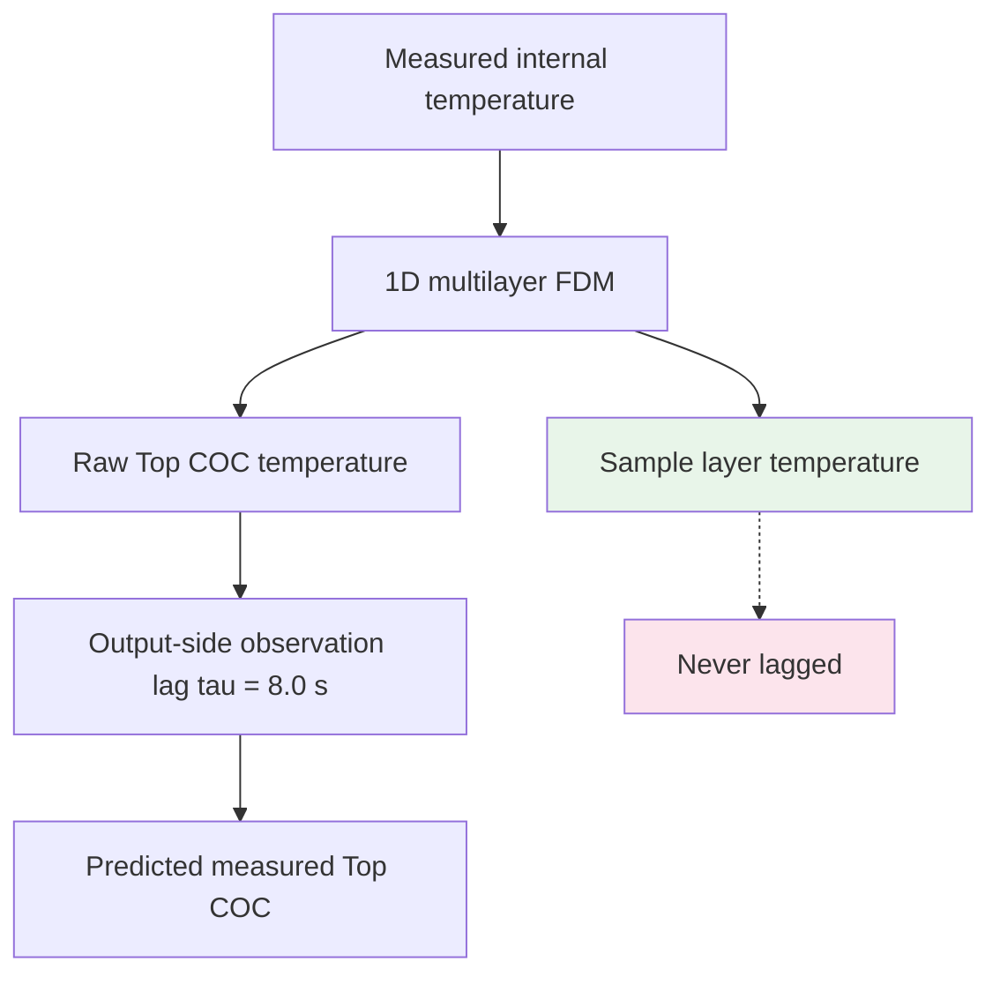
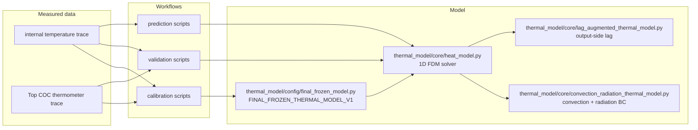

# Code Architecture — 1D Thermal Model for Fast Digital PCR

This document explains how the repository works internally: the physical
problem, the numerical implementation, the calibration and validation
pipelines, the data flow between modules, and where future changes should be
made. It is written for researchers and developers who need to understand,
maintain, audit, or extend the code.

The current authoritative model is **`FINAL_FROZEN_THERMAL_MODEL_V1`**
(frozen). See the [README](../README.md) for the user-facing quick start and
[FINAL_MODEL_RELEASE.md](FINAL_MODEL_RELEASE.md) for release notes.

---

## 1. Scientific Objective

The device directly measures an **internal device temperature** (a
Peltier-associated sensor inside the instrument). The PCR chip itself — a
thin COC (cyclic olefin copolymer) cartridge holding a water-based sample
under a mineral-oil layer — is not instrumented:

- the **sample-layer temperature** (the biologically relevant quantity) is
  never directly measured;
- an independent **Top COC thermometer** measures the outer chip surface,
  but only as a separate recording.

The scientific objective is to estimate the **chip-layer thermal response**
and especially the **sample-layer temperature** from the measured internal
trace, while using the measured Top COC temperature to **calibrate and
validate** the model.

A **reduced-order 1D model** is used because:

- the chip is a thin multilayer stack with a strongly dominant
  through-thickness temperature gradient (lateral conduction is secondary);
- 1D transient simulations are fast enough for parameter sweeps and for
  interactive tools, while retaining the physics that matters (layer
  thermal mass, interface resistance, surface heat loss).

## 2. Physical Stack

### 2.1 Bare-top configuration (calibrated + externally validated)

`BARE_TOP_COC_LAYERS` — total thickness **850 um** (bottom to top):

| layer | material | thickness |
|---|---|---|
| Bottom COC | COC | 180 um |
| PCR sample | Water | 20 um |
| Mineral oil | Oil | 50 um |
| Top COC | COC | 600 um |

The bottom of the stack (`x = 0`) is the **Dirichlet boundary** where the
measured internal temperature is imposed. The Top COC outer surface
(`x = 850 um`) is exposed to ambient air; external convection and radiation
are applied there.

### 2.2 Insulated configuration (forward-model extension only)

`LEGACY_INSULATED_LAYERS` — total thickness **4050 um**:

| layer | material | thickness |
|---|---|---|
| Bottom COC | COC | 180 um |
| PCR sample | Water | 20 um |
| Mineral oil | Oil | 50 um |
| Top COC | COC | 600 um |
| Sealed air gap | Air | 3000 um |
| Cap PDMS | PDMS | 200 um |

In this architecture external convection/radiation moves to the **outer PDMS
surface**. Simplifications (documented, not independently validated):

- the sealed air gap is treated as **pure conduction**;
- no internal-gap natural convection and no surface-to-surface radiation
  across the gap are modeled.

The insulated geometry was used only for **forward sample prediction** and
is **not** independently validated as an insulated experimental geometry.

## 3. Governing Equation

The model solves the transient 1D heat equation for each layer:

$$\rho c_p \frac{\partial T}{\partial t} = \frac{\partial}{\partial x}
\left(k \frac{\partial T}{\partial x}\right)$$

with layer-dependent material properties `(k, rho, cp)`.

### 3.1 Spatial discretization (node-centered finite volumes)

- Each layer is discretized with a target cell size (`dx_target_m`); the
  stack is meshed into `Nx` nodes with node positions `x[i]` and cell sizes
  `h[i]`.
- **Control volumes**: interior node `i` owns the interval
  `[(x[i-1]+x[i])/2, (x[i]+x[i+1])/2]`; boundary nodes use the actual domain
  boundary. The control volumes tile the whole domain exactly.
- **Face conductivity** `k_face[i]` for interval `[x[i], x[i+1]]`:
  material interfaces are placed exactly on nodes, so each interval lies in
  a single material and `k_face` is simply that material's `k` (no harmonic
  averaging of two endpoint materials — a deliberate correction of an
  earlier implementation).
- **Volumetric heat capacity** `rho_cp[i]`: for ordinary nodes this is the
  material's `rho * cp`; at a material-interface node the two half-volumes
  are combined with half-width volume weighting.
- **Sample-layer extraction**: the sample temperature is the
  control-volume-weighted spatial average over the layer with
  `role="sample"`. Weights are the overlap lengths between each node's
  control volume and the sample-layer interval
  (`compute_sample_weights`), normalized so they sum to 1. This is why the
  sample output is a **layer average**, not a single arbitrary grid node.

### 3.2 Time integration (explicit Forward Euler)

- The time step is fixed by a **stability constraint** computed node by
  node (see `_compute_dt` in `heat_model.py`):

  ```
  dt_i <= rho_cp_i * (h_m + h_p) / [2 * (k_p/h_p + k_m/h_m)]
  dt    = 0.9 * min_i(dt_i)
  ```

  where `h_m`/`h_p` are the left/right neighbor spacings and `k_m`/`k_p`
  the adjacent face conductivities. The same `k_face`/`rho_cp` coefficients
  used in the update are used here, and a 0.9 safety factor is applied.
- Each interior node is updated with a fully vectorized three-point stencil:

  ```
  T_new[i] = c_c[i] * T[i] + c_m[i] * T[i-1] + c_p[i] * T[i+1]
  ```

  where the coefficients encode `k_face` / `h` / `rho_cp` and the stability
  factor `fac = 2*dt / ((h_m + h_p) * rho_cp)`.

- Output is downsampled to `save_dt` intervals; the full-resolution grid is
  retained in `time_fdm` / `T_final`.

The only authoritative solver is `thermal_model/core/heat_model.py`
(`run_simulation`). A separate finite-volume reference implementation
(`fv_reference.py`) exists for cross-validation in tests only.

## 4. Boundary Conditions

### 4.1 Bottom boundary (Dirichlet)

The measured internal temperature trace is imposed as a time-dependent
Dirichlet condition at `x = 0`:

```
T[0](t) = T_internal(t)   (interpolated onto the FDM time grid)
```

The solver does not care where the trace comes from (measured internal
temperature, calibrated surface model, or synthetic protocol).

### 4.2 Top boundary (Robin — convection + radiation)

At the outermost surface the conductive flux balances convection plus
radiation:

```
q_cond = q_conv + q_rad

q_conv = h_conv * (T_surface - T_env)

q_rad  = epsilon * sigma_SB * F_view
         * ( (T_surface + 273.15)^4 - (T_env + 273.15)^4 )
```

The radiation term is the **nonlinear Stefan-Boltzmann** law, always
evaluated in **kelvin**. It is not linearized into a fixed `h_rad` for the
numerical boundary condition.

Fixed boundary parameters (the single source of truth is
`thermal_model/core/convection_radiation_thermal_model.py`):

| constant | value |
|---|---|
| h_conv | 10.0 W/(m2 K) |
| epsilon | 0.90 |
| sigma_SB | 5.670374419e-8 W/(m2 K4) |
| F_view | 1.0 |

Environment rule: `T_env` is a **constant scalar** taken as the first valid
measured Top COC temperature for calibration/validation runs; the prediction
tool uses the first recorded internal temperature as a proxy when no Top
measurement is available. It is never the full measured Top trace.

For the bare architecture the Robin condition is at the Top COC outer
surface; for the insulated architecture it is at the outer PDMS surface.

## 5. Top Observation Lag

`tau_top = 8.0 s` is an **effective Top observation / measurement-chain
lag**, not an intrinsic thermometer time constant.

Architecture:

```
raw FDM Top temperature
        |
        v
first-order observation lag:  tau * dy/dt + y = x(t)
        |
        v
predicted measured Top COC
```

The lag is implemented as the **exact analytic update** for piecewise-linear
input (`apply_first_order_lag` in
`thermal_model/core/lag_augmented_thermal_model.py`):

```
y1 = x1 - m*tau + (y0 - x0 + m*tau) * exp(-dt/tau)
```

It supports non-uniform time steps, `tau = 0` is exactly the identity, and
the initial output defaults to the input's first value.

The lag may capture a combination of sensor response, contact, sampling,
wiring, and other unresolved observation-chain effects. It must **not** be
identified as a direct intrinsic thermometer time constant.

## 6. Why the Sample Temperature Is Not Lagged

The sample temperature is the **raw FDM sample-layer temperature** — the
control-volume-weighted average of the physical temperature field over the
sample layer.

The Top observation lag is applied **only** to the predicted Top
measurement. It is **never** applied to:

- the sample temperature,
- the internal bottom boundary,
- the physical chip model itself.

The separation is deliberate: the lag models the observation chain of the
Top thermometer, not the physics of the chip.



## 7. Materials and Effective Parameters

Material definitions live in `thermal_model/core/heat_model.py`
(`DEFAULT_MATERIALS`):

| material | k (W/(m K)) | rho (kg/m3) | cp (J/(kg K)) |
|---|---|---|---|
| COC (reference) | 0.13 | 1020 | 1800 |
| Water (sample) | 0.60 | 1000 | 4180 |
| Oil | 0.142 | 876 | 1962 |
| Air | 0.0257 | 1.204 | 1005 |
| PDMS | 0.15 | 970 | 1460 |

These are **reference physical properties** used for the non-fitted layers
(sample water, oil, air, PDMS) and as the nominal COC reference.

The calibrated model replaces the **COC** properties with **effective
reduced-order parameters**:

```
k_eff  = 0.0675 W/(m K)
cp_eff = 700 J/(kg K)
```

`make_convection_radiation_materials(k_eff, cp_eff, rho_COC)` returns a
copy of the material library with only COC modified (the global
`DEFAULT_MATERIALS` is never mutated). `rho_COC = 1020 kg/m3` is fixed.

`k_eff` / `cp_eff` / `tau_top` are **effective, system-level** parameters
obtained by calibration; they are **not** newly measured intrinsic TOPAS/COC
material constants.

## 8. Calibration Pipeline

The final calibration used the corrected **66 C** dataset (bare-top Top COC
+ matching internal trace) and is implemented in
`workflows/calibration/recalibrate_thermal_model_66C_redo.py`.

Measured inputs:

- internal temperature trace (bottom Dirichlet boundary),
- Top COC temperature trace (comparison target).

Free effective parameters (fitted):

- `k_eff`
- `cp_eff`
- `tau_top`

Fixed (not fitted):

- `rho_COC`, `h_conv`, `epsilon`, `sigma_SB`, `F_view`, geometry
  (`BARE_TOP_COC_LAYERS`), lag placement (output-side, Top only).

Objective pipeline per candidate parameter set:

1. run the FDM simulation from the internal trace,
2. produce the raw Top prediction,
3. apply the output-side observation lag,
4. interpolate the prediction at the **actual measured Top timestamps**,
5. compute the RMSE against the measured Top COC.

The objective uses **measured time as the interpolation coordinate**. A
historical implementation bug used the measured *temperature* as the
interpolation coordinate; this is explicitly prevented and regression-tested
(the measured temperature must never be used as the interpolation
coordinate).

qPCR/sample predictions were **not** part of the fitting objective
(anti-circularity safeguard).

### Search strategy

- coarse grid search over `(k_eff, cp_eff, tau_top)`,
- boundary check with expansion where the optimum hits a grid edge,
- local refinement near the best region,
- examination of the near-optimal band and final candidate selection.

Final values: `k_eff = 0.0675`, `cp_eff = 700`, `tau_top = 8.0`.

## 9. Validation Pipeline

Validation is strictly **zero-refit**:

1. freeze the parameters (do not touch them),
2. feed an independent measured internal trace,
3. predict Top COC with the frozen model,
4. apply the fixed observation lag,
5. compare against independent measured Top COC,
6. report RMSE — no refitting of any kind.

Authoritative validation results:

| dataset | RMSE |
|---|---|
| 60 C | 1.3749 C |
| 72 C | 3.0817 C |
| 3 s extension | 1.0643 C |
| mean external-validation RMSE | 1.8403 C |
| median / worst | 1.3749 / 3.0817 C |

### Synchronization

Experimentally known timing information is allowed; data-driven time-shift
optimization is not.

- **60 C / 72 C**: `SETPOINT_90C_EVENT_PLUS_1S` — the Top COC recording
  starts 1.0 s after the internal protocol's Setpoint column enters
  90.000 C. The anchor is the Setpoint column only (never the measured
  zone temperature). Implemented in
  `workflows/validation/validate_66C_candidate_known_offset.py`.
- **3 s extension**: `SIMULTANEOUS_START_RELATIVE_T0` — documented
  simultaneous-start alignment with no fitted time shift.

## 10. Full-History Semantics

An important implementation detail: when only a time window is analyzed
(`--start-s` / `--end-s` in the prediction tool), the simulation **still
starts from the complete available thermal history**. The window arguments
crop the analysis/output only; they never reinitialize the physics at the
window start.

This is physically necessary because the thermal state at any time depends
on the full prior history (thermal mass, stored energy, lag state). For
transient PCR protocols with rapid ramps and holds, reinitializing at the
window start would produce a materially different (and wrong) prediction.

## 11. Calibration / Validation / Prediction Data Flow



Dependency direction (enforced by the package layout):

```
workflows/*          (application entry points)
    -> thermal_model.config   (frozen model, metadata)
    -> thermal_model.core     (solver, boundary, lag, FV reference)
    -> thermal_model.utilities (loaders, peak detection, plotting)
```

Core modules never import application workflows.

## 12. Module-Level Architecture

### `thermal_model/core/`

| module | role |
|---|---|
| `heat_model.py` | authoritative 1D multilayer transient FDM solver; `Material` / `Layer` / `LayerStack`; mesh building (`build_layer_stack`), control-volume weights (`compute_sample_weights`), stability step (`compute_stable_dt`), `run_simulation`; layer presets `BARE_TOP_COC_LAYERS` / `LEGACY_INSULATED_LAYERS` / `DEFAULT_MATERIALS` |
| `convection_radiation_thermal_model.py` | top boundary physics (convection + nonlinear Stefan-Boltzmann); fixed constants h=10, eps=0.90, sigma, F=1.0; `make_convection_radiation_materials` (COC-only override); `run_convection_radiation_fdm` (convection/radiation runner with lag) |
| `lag_augmented_thermal_model.py` | output-side first-order observation lag (`apply_first_order_lag`, exact piecewise-linear recursion); lag-augmented model wrapper |
| `fv_reference.py` | independent finite-volume reference implementation, used by tests to cross-check the FDM solver |

### `thermal_model/config/`

| module | role |
|---|---|
| `final_frozen_model.py` | **authoritative final configuration**: `FINAL_FROZEN_THERMAL_MODEL_V1` frozen dataclass + constants, derived properties (alpha, effusivity), validation RMSEs, known limitation, freeze rule |
| `final_frozen_model_metadata.json` | machine-readable metadata (params, calibration vs external validation vs sample prediction, limitations) |
| `calibrated_model_config.py` | legacy nominal calibration config (superseded; kept for provenance) |

### `thermal_model/utilities/`

Reusable helpers shared by workflows:

- `predict_sample_from_internal_temperature.py` — authoritative internal-workbook loader (sheet/time/temperature-column semantics reused by the prediction tool),
- `classify_temperature_regimes.py` — heating / cooling / settling regime classification,
- `phase_thermal_dwell.py` — phase-specific dwell statistics,
- `analyze_frozen_sample_peak.py` — repeated-cycle sample peak detector,
- `align_internal_and_top_temperature.py` — timestamp alignment utilities,
- `scan_effective_thermal_parameters.py` — effective-parameter scan framework,
- `lag_placement_comparison_model.py` — lag-placement architecture comparison,
- `validate_frozen_model_two_new_bare_top_datasets.py` — dataset loaders + regime labels,
- `draggable_hlines.py` — import-safe interactive draggable threshold lines (used by the prediction GUI).

### `thermal_model/historical/`

- `frozen_strategy_G_candidate.py` — superseded frozen candidate
  (k = 0.055, cp = 1200, tau = 8.5), preserved for provenance only.

### `workflows/`

| package | role |
|---|---|
| `calibration/` | parameter-calibration scripts (66 C redo — final; strategies B/C/D/F/G — advanced/historical) |
| `validation/` | zero-refit external-validation scripts (known-offset authoritative; multi-dataset earlier; generic runner) |
| `prediction/` | sample-temperature prediction tools (primary CLI + cross-protocol analyses) |
| `diagnostics/` | numerical/experimental cross-checks and plotting helpers |
| `legacy/` | provenance-only scaffold (`main.py`), not part of the scientific workflow |

## 13. Authoritative Files

A new developer must know what **not** to edit casually:

| item | path |
|---|---|
| Authoritative final configuration | `thermal_model/config/final_frozen_model.py` |
| Machine-readable metadata | `thermal_model/config/final_frozen_model_metadata.json` |
| Historical (superseded) configuration | `thermal_model/historical/frozen_strategy_G_candidate.py` |
| Primary user workflow | `workflows/prediction/predict_sample_temperature_frozen_model.py` |
| Final-model release notes | `docs/FINAL_MODEL_RELEASE.md` |
| Calibration history | `docs/CALIBRATION_HISTORY.md` |
| This architecture guide | `docs/CODE_ARCHITECTURE.md` |
| Repository manifest | `docs/REPOSITORY_MANIFEST.md` |

## 14. Freeze / Versioning Rule

`FINAL_FROZEN_THERMAL_MODEL_V1` is **frozen**. Any future change to:

- k, cp, tau,
- h, epsilon,
- geometry (layer stack),
- lag placement,
- numerical physics,

must be introduced as a **new model version** (e.g. V2), never as a silent
modification of V1. The freeze rule is enforced in the codebase by an
immutable dataclass and documented in
`thermal_model/config/final_frozen_model.py` and
`docs/FINAL_MODEL_RELEASE.md`.

## 15. If You Need to Modify the Model

| change | where |
|---|---|
| material properties | `thermal_model/core/heat_model.py` (`DEFAULT_MATERIALS`) — or create new materials via `make_convection_radiation_materials` / `make_lag_materials` |
| geometry (layer stack) | `thermal_model/core/heat_model.py` (`BARE_TOP_COC_LAYERS`, `LEGACY_INSULATED_LAYERS`, `LAYER_STACK_PRESETS`) |
| final model parameters | `thermal_model/config/final_frozen_model.py` — **only as a new version**, never by editing V1 in place |
| boundary conditions | `thermal_model/core/convection_radiation_thermal_model.py` (convection/radiation) and `heat_model.py` (Robin BC coefficients in `run_simulation`) |
| observation lag | `thermal_model/core/lag_augmented_thermal_model.py` (`apply_first_order_lag`, `tau_top`) |
| input parsing | `thermal_model/utilities/predict_sample_from_internal_temperature.py` (shared loader) and `workflows/prediction/predict_sample_temperature_frozen_model.py` (`load_internal_data`) |
| plotting / output | `workflows/prediction/predict_sample_temperature_frozen_model.py` (plot + CSV + summary writers), `thermal_model/utilities/draggable_hlines.py` (interactive lines) |
| calibration strategy | `workflows/calibration/` (66 C redo for the final calibration; strategy scripts B–G for alternatives) |
| validation protocol | `workflows/validation/validate_66C_candidate_known_offset.py` (authoritative known-offset), `validate_66C_candidate_multi_dataset.py` (multi-dataset) |

> Do not modify the frozen V1 configuration without creating a new model
> version.

## 16. Common User Mistakes (Troubleshooting)

| mistake | what actually happens / fix |
|---|---|
| wrong workbook or missing `Zone 1 Avg (°C)` column | the loader raises a clear `KeyError` listing available columns; export the sheet `Extracted_Data` from the device software |
| running a script from the wrong working directory | scripts resolve `PROJECT_ROOT` from `__file__`, so relative paths are safe; still, data workbooks live outside the repo by design (do not commit them) |
| using system Python instead of `uv` | use `uv run python ...` (or activate `.venv/`) so the locked dependency set is used |
| confusing Top COC validation with sample prediction | Top COC RMSE validates the model's surface prediction; the sample layer is a model-predicted hidden state with no measured RMSE |
| treating `--start-s` as simulation initialization | `--start-s` / `--end-s` only crop analysis/output; the simulation always starts from the full trace |
| assuming the insulated geometry is experimentally validated | it is a forward-model extension only; do not quote validation RMSEs for it |
| modifying `final_frozen_model.py` in place | violates the freeze rule; create a new model version instead |
| expecting the output lag to affect sample temperature | the lag applies to the Top observation only; sample temperature is never lagged |

## 17. Tests

- Run: `uv run pytest -q`
- At the final V1 release the suite contained **823 passing tests**,
  covering numerical regression (FDM vs FV reference), interface and
  discretization behavior, calibration/validation structure,
  anti-circularity safeguards (qPCR never in the fitting objective), and
  CLI behavior of the primary prediction tool.
- `tests/conftest.py` adds the repository root and `Surface_calibration/`
  to `sys.path` and forces a headless matplotlib backend for integration
  tests.
